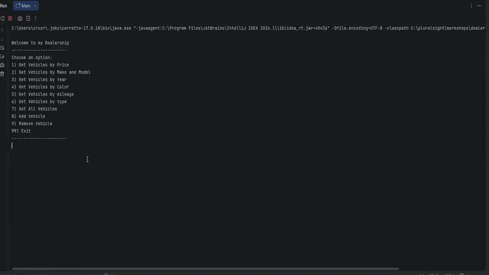

# Dealership

## Description of the Project

looks though the dealership.csv and loads it into an array. the user has options to look by price,
 make/model, year, color, mileage, vehicle type. the user can also add or remove an item from the list.

## User Stories

as a customer i would like to have a main menu.

as a manager i would like to save all sells to a cvs file

make Dealership class to hold all information of the dealership and hold the vehicles from the vehicle class

## Setup
Instructions on how to set up and run the project using IntelliJ IDEA.

### Prerequisites

- IntelliJ IDEA: Ensure you have IntelliJ IDEA installed, which you can download from [here](https://www.jetbrains.com/idea/download/).
- Java SDK: Make sure Java SDK is installed and configured in IntelliJ.

### Running the Application in IntelliJ

Follow these steps to get your application running within IntelliJ IDEA:

1. Open IntelliJ IDEA.
2. Select "Open" and navigate to the directory where you cloned or downloaded the project.
3. After the project opens, wait for IntelliJ to index the files and set up the project.
4. Find the main class with the `public static void main(String[] args)` method.
5. Right-click on the file and select 'Run 'YourMainClassName.main()'' to start the application.

## Technologies Used

- Java: Mention the version you are using.
- Any additional libraries or frameworks used in the project.

## Demo One

## Future Work

Outline potential future enhancements or functionalities you might consider adding:

- Additional feature to be developed.
- Improvement of current functionalities.

## Resources

List resources such as tutorials, articles, or documentation that helped you during the project.

- [Java Programming Tutorial](https://www.example.com)
- [Effective Java](https://www.example.com)

## Team Members

- **Rickelvi Cruz** - Project owner.

## Thanks

- Thank you to Raymon for continuous support and guidance.
- A special thanks to all teammates for their dedication and teamwork.
 